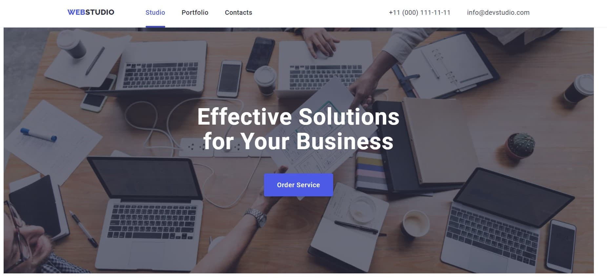
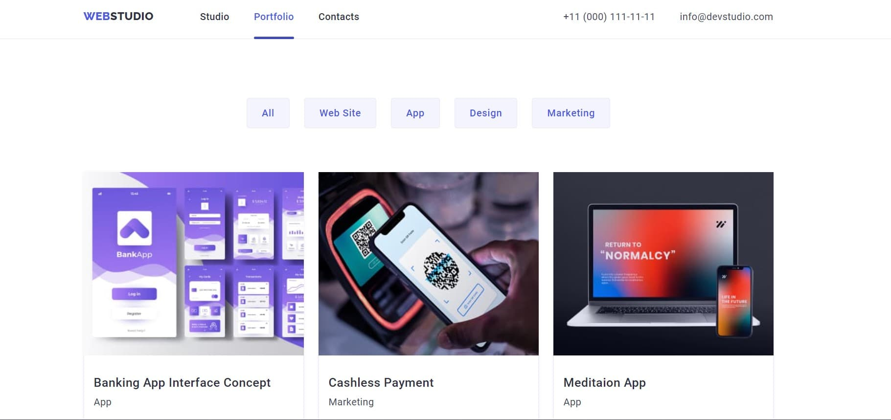

# WebStudio

A website project with a responsive layout that involved using GitHub, HTML5, CSS, and JavaScript.

This WebStudio project showcases my strong frontend skills and commitment to delivering high-quality
user experiences.

## Table of content

- [Features](#features)
- [Technologies Used](#technologies-used)

## Features

Used CSS Flexbox methods for consistent and attractive page layouts.

Added animations and transitions to make the site more engaging for users.

Created a portfolio section displaying various projects to exhibit web design and development
skills.

Checked compatibility across browsers and devices for a smooth user experience.

Successfully launched the website online.

## Technologies Used

- HTML5
- CSS3
- JavaScript
